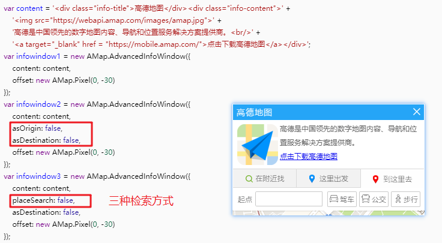
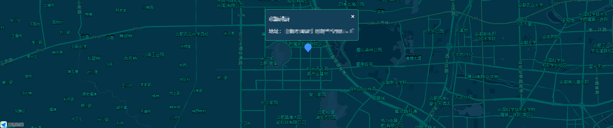

[高德地图开放平台](https://lbs.amap.com/api/javascript-api/guide/abc/prepare)

[控制台](https://console.amap.com/dev/)

## 快速上手

```html
<!DOCTYPE html>
<html lang="en">
<head>
    <meta charset="UTF-8">
    <meta http-equiv="X-UA-Compatible" content="IE=edge">
    <meta name="viewport" content="width=device-width, initial-scale=1.0">
    <title>Document</title>
    <style>
        body {
            width: 100%;
            height: 100%;
            overflow: hidden;
        }
        
        #container {
            width: 800px;
            height: 500px;
            margin: 200px auto;
        }
    </style>
</head>
<body>
    <div id="container"></div>

    <script type="text/javascript" src="https://webapi.amap.com/maps?v=1.4.15&key=key"></script>
    <script>
        // 创建地图，并且设置中心点、级别、显示模式、自定义样式等属性
        var map = new AMap.Map('container', {
            zoom: 13, //级别:地图细致程度
            center: [117.137497, 31.832803], //中心点坐标
            viewMode: '3D', //使用3D视图
            // layers: [ //创建地图时就直接使用多个图层
            //     new AMap.TileLayer.Satellite(),
            //     new AMap.TileLayer.RoadNet()
            // ],
            // zooms: [4, 18], //设置地图级别范围
            mapStyle: 'amap://styles/dark', //设置地图的显示样式
        });

        // 默认情况，地图只显示标准底图，如需要叠加别的图层，通过map.add方法添加图层：
        //实时路况图层
        var trafficLayer = new AMap.TileLayer.Traffic({
            zIndex: 11
        });
        map.add(trafficLayer); //添加图层到地图
    </script>
</body>
</html>
```

[map类的mapOptions](https://lbs.amap.com/api/javascript-api/reference/map)

### 图层

[官方文档](https://lbs.amap.com/api/javascript-api/guide/abc/quickstart)

1. 标准图层 [TileLayer](https://lbs.amap.com/api/javascript-api/reference/layer#TileLayer)
2. 卫星图层 [TileLayer.Satellite ](https://lbs.amap.com/api/javascript-api/reference/layer#TileLayer.Satellite)   卫星图层与路网图层通常一起使用，这两个图层的创建和使用方法和`TileLayer`类似，只需要修改类名为对应的类名即可。
3. 路网图层 [TileLayer.RoadNet](https://lbs.amap.com/api/javascript-api/reference/layer#TileLayer.RoadNet)
4. 实时交通图层 [TileLayer.Traffic](https://lbs.amap.com/api/javascript-api/reference/layer#TileLayer.Traffic)
5. 楼块图层 [Buildings](https://lbs.amap.com/api/javascript-api/reference/layer#buildings)
6. 室内地图 [IndoorMap](https://lbs.amap.com/api/javascript-api/reference/indoormap)

### 点标记

```js
        // 创建地图，并且设置中心点、级别、显示模式、自定义样式等属性
        var map = new AMap.Map('container', {
            zoom: 13, //级别:地图细致程度
            center: [117.137497, 31.832803], //中心点坐标
            viewMode: '3D', //使用3D视图
        });

        document.getElementById('addBtn').onclick = function() {
            addMarker()
        }

	    //添加标记
        function addMarker(position) {
            console.log(position);
            var marker = new AMap.Marker({
                // icon: "//a.amap.com/jsapi_demos/static/demo-center/icons/poi-marker-default.png",
                icon: icon(), //icon方式一
                position: [117.137497, 31.832803],
                // offset: new AMap.Pixel(-13, -30)
                title: 'B3', //hover时的title
                anchor: 'bottom-left', // 设置锚点方位
                // map: map//直接指定地图：将标记添加到地图中
                // label: {
                //     content: '我是文本标注',
                //     offset: new AMap.Pixel(25, 25)
                // }

            });
            map.add(marker); //两种方法都可以将标记添加到地图中
            // m.setMap(map);

            // icon方式二：向已创建好的 Marker 添加 Icon
            // m.setIcon(icon());

            // label方式二:添加label
            // m.setLabel({
            //     offset: new AMap.Pixel(20, 20), //设置文本标注偏移量
            //     content: "<div class='info'>我是 marker 的 label 标签</div>", //设置文本标注内容
            //     direction: 'right' //设置文本标注方位
            // });
            map.setFitView(); //根据地图上添加的覆盖物分布情况， 自动缩放地图到合适的视野级别(添加多个标记)
        }

	    //移除标记
        function removeMarker() {
            map.remove(marker)
        }

        // 为创建的 Marker 指定 Icon 实例。 此种方式可以设置图标大小， 偏移等属性， 比单纯设置 URL 更加灵活。 创建方式如下
        // 创建 AMap.Icon 实例：
        function icon() {
            var icon = new AMap.Icon({
                size: new AMap.Size(26.5, 34), // 图标尺寸
                image: '//a.amap.com/jsapi_demos/static/demo-center/icons/poi-marker-default.png', // Icon的图像
                // imageOffset: new AMap.Pixel(0, -60), // 图像相对展示区域的偏移量，适于雪碧图等
                imageSize: new AMap.Size(26.5, 34) // 根据所设置的大小拉伸或压缩图片
            });
            return icon
        }
```

### 事件

```js
//事件的绑定与解绑
// 绑定事件(方式一)
map.on('click', clickHandler);
// 解绑事件
map.off('click', clickHandler);


//添加事件(方式二)：向marker标记添加点击事件
AMap.event.addListener(marker, 'click', function() {
    //
});
//向map地图添加点击事件
AMap.event.addListener(map, 'click', function() {
    //
});


//给div绑定单击事件
AMap.event.addDomListener(button2, 'click', function() {
    //
})
```

事件练习：点击地图添加标记，输出坐标结果

```html
<head>
    <meta charset="utf-8">
    <meta http-equiv="X-UA-Compatible" content="chrome=1">
    <meta name="viewport" content="initial-scale=1.0, user-scalable=no, width=device-width">
    <title>DOM事件</title>
    <link rel="stylesheet" href="https://a.amap.com/jsapi_demos/static/demo-center/css/demo-center.css" />
    <style>
        html,
        body,
        #container {
            height: 100%;
            width: 100%;
        }
    </style>
</head>

<body>
    <div id="container"></div>
    <div class="input-card" style="width:18rem;height:10rem">
        <h4>DOM事件的绑定与解绑</h4>
        <div>
            <div class="input-item">
                <button id="bt1" class="btn" style="margin:0 1rem 1rem 0;">绑定事件</button>
                <button id="bt2" class="btn" style="margin-bottom:1rem;">解绑事件</button>
                <button id="bt3" class="btn" style="margin-right:1rem;">清理地图</button>
                <button id="bt4" class="btn">输出结果</button>
            </div>
        </div>
    </div>
    <div class="info" id="tip">给页面中的两个按钮绑定事件，绑定后单击地图可添加Marker</div>
    <script type="text/javascript" src="https://webapi.amap.com/maps?v=1.4.15&key=key"></script>
    <script type="text/javascript">
        var clickListener, res = [],
            map = new AMap.Map('container', {
                resizeEnable: true,
                center: [116.39, 39.9]
            });
        //bt1的click的绑定事件
        var bind = function() {
            remove(); //防止重复绑定
            clickListener = AMap.event.addListener(map, "click", function(e) {
                console.log(e.lnglat);
                res.push({
                    x: e.lnglat.getLng(),
                    y: e.lnglat.getLat()
                })

                //添加标记
                new AMap.Marker({
                    position: e.lnglat,
                    map: map
                });
            });
        };
        // bt2的click的绑定事件
        var remove = function() {
            if (clickListener) {
                AMap.event.removeListener(clickListener); //移除事件，以绑定时返回的对象作为参数
            }
        };

        var button1 = document.getElementById('bt1');
        var listener1 = AMap.event.addDomListener(button1, 'click', bind); //给div绑定单击事件  
        var button2 = document.getElementById('bt2');
        var listener2 = AMap.event.addDomListener(button2, 'click', remove); //给div绑定单击事件
        var button3 = document.getElementById('bt3');
        var listener3 = AMap.event.addDomListener(button3, 'click', function() {
            res = []
            map.clearMap();
        }); //给div绑定单击事件
        var button4 = document.getElementById('bt4');
        var listener4 = AMap.event.addDomListener(button4, 'click', function() {
            console.log(res);
        }); //给div绑定单击事
    </script>
</body>

```

### 信息窗体

```js
//地图初始化时，在地图上添加一个marker标记,鼠标点击marker可弹出自定义的信息窗体
var map = new AMap.Map("container", {
    resizeEnable: true,
    center: [116.481181, 39.989792],
    zoom: 16
});

addMarker();

//添加marker标记
function addMarker() {
    map.clearMap();
    var marker = new AMap.Marker({
        map: map,
        position: [116.481181, 39.989792]
    });
    //鼠标点击marker弹出自定义的信息窗体⭐⭐
    AMap.event.addListener(marker, 'click', function() {
        infoWindow.open(map, marker.getPosition());
    });
}

var infoWindow = new AMap.InfoWindow({
    isCustom: true, //使用自定义窗体
    content: createInfoWindow('closeInfoWindow'),
    offset: new AMap.Pixel(16, -45)
});

//构建自定义信息窗体
function createInfoWindow(fn) {
    var info = document.createElement("div");
    info.innerHTML = `<div class="info_window">
                        <div class="top">方恒假日酒店<span>价格：318</span><span class="x" onclick="${fn}()">x</span></div>
                        <div class="bottom">
                            <div class="image">
                            	
                            </div>
                            <div class="article">
                                <p>地址：北京市朝阳区阜通东大街6号院</p>
                                <p>3号楼东北3.8公里</p>
                                <p>电话：010-64733333</p>
                                </div>
                            </div>
                      </div>`
    return info;
}
//关闭信息窗体
function closeInfoWindow() {
    map.clearInfoWindow();
}
```

添加信息窗体：

```js
infoWindow.open(map, marker.getPosition());
```

移除信息窗体

```js
map.clearInfoWindow();
```

[带检索功能的信息窗体](https://lbs.amap.com/demo/javascript-api/example/infowindow/infowindow-has-search-function)

 

## vue中使用amap原生sdk

public中index.html引入

> 引入的高德js一定要放在头部而不是尾部，否则就会报 “AMap is not defined”

```html
<head>
    <meta charset="utf-8">
    <meta http-equiv="X-UA-Compatible" content="IE=edge">
    <meta name="viewport" content="width=device-width,initial-scale=1.0">
    <link rel="icon" href="<%= BASE_URL %>favicon.ico">
    <title>amap</title>
    <script type="text/javascript" src="https://webapi.amap.com/maps?v=1.4.15&key=key"></script>
</head>
```

vue.config.js中

```js
module.exports = {
    configureWebpack: {
        externals: {
            AMap: 'AMap'
        },
    },
}
```

### 案例



amap.vue

```vue
<template>
  <div id="container" @mousewheel="footWhell"></div>
</template>

<script>
import AMap from "AMap"
export default {
  data() {
    return {
      map: null,
      marker: null,
      infoWindow: null,
    }
  },
  mounted() {
    this.init()
  },
  methods: {
    //地图区域使用滚轮时，阻止事件冒泡
    footWhell(e) {
      e.stopPropagation()
    },
    init() {
      const _this = this
      //创建地图
      this.map = new AMap.Map("container", {
        zoom: 13, //级别:地图细致程度
        center: [117.137497, 31.832803], //中心点坐标
        viewMode: "3D", //使用3D视图
        mapStyle: "amap://styles/blue", //设置地图的显示样式
      })
        
      //添加标记
      this.marker = new AMap.Marker({
        icon: _this.icon(), //icon方式一
        position: [117.137497, 31.832803],
        // offset: new AMap.Pixel(-13, -30)
        title: "B3", //hover时的title
        anchor: "bottom-left", // 设置锚点方位
        map: _this.map, //直接指定地图：将标记添加到地图中
      })
        
      //创建信息窗体
      this.infoWindow = new AMap.InfoWindow({
        isCustom: true, //使用自定义窗体
        content: _this.createInfoWindow("closeInfoWindow"),
        offset: new AMap.Pixel(16, -65),
      })
      //默认打开信息窗体
      this.infoWindow.open(_this.map, _this.marker.getPosition())
      
      //点击marker打开信息窗体
      AMap.event.addListener(this.marker, "click", function() {
        _this.infoWindow.open(_this.map, _this.marker.getPosition())
      })
    },
    icon() {
      return new AMap.Icon({
        size: new AMap.Size(26.5, 34), // 图标尺寸
        image:
          "//a.amap.com/jsapi_demos/static/demo-center/icons/poi-marker-default.png", // Icon的图像
        // imageOffset: new AMap.Pixel(0, -60), // 图像相对展示区域的偏移量，适于雪碧图等
        imageSize: new AMap.Size(26.5, 34), // 根据所设置的大小拉伸或压缩图片
      })
    },
    createInfoWindow() {
      const info = document.createElement("div")
      info.style.background = "rgb(19, 63, 88)"
      info.style.padding = "10px"
      info.style.borderRadius = "5px"
      info.style.border = "1px solid rgb(0, 204, 132)"
      info.style.color = "#eee"

      //标题
      const tit = document.createElement("div")
      tit.style.padding = "10px 0"
      tit.style.fontWeight = 700
      tit.innerText = "卓源科技"
      // 关闭
      const close = document.createElement("span")
      close.innerText = "×"
      close.style.float = "right"
      close.style.fontSize = "18px"
      close.style.marginTop = "-10px"
      close.style.cursor = "pointer"
      close.onclick = this.closeInfoWindow
      tit.appendChild(close)
      info.appendChild(tit)
      //内容
      const article = document.createElement("div")
      article.innerText = "地址：合肥市高新区创新产业园B3-5F"
      article.style.padding = "10px 0"
      info.appendChild(article)
      return info
    },
    //关闭信息窗体
    closeInfoWindow() {
      this.map.clearInfoWindow()
    },
  },
}
</script>

<style scoped lang="scss">
#container {
  position: absolute;
  width: 100%;
  font-size: 0.083333rem;
  height: 400px;
  touch-action: auto;
}
</style>

```

