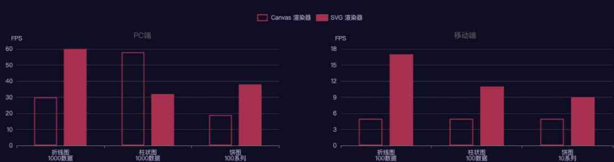

## [echarts](https://echarts.apache.org/)

### 前端可视化的工具

* 常见的框架： ECharts 、g2、d3、vis、hightChart等等； 
* g2框架封装：bizcharts(react) viser(vue)； 
* 地理可视化： g2、L7、高德的 Loca、 菜鸟的 鸟图； 
* 3D可视化：three.js；

### 认识echarts

* 什么是ECharts呢？官方的解释是：`一个基于 JavaScript 的开源可视化图表库`

* ECharts的历史： 
  * ECharts由`百度`团队开源； 
  * 2018年初，捐赠给`Apache基金会`，成为ASF（Apache Software Foundation，简称为ASF，Apache软件基金会）孵化级项目； 
  * 2021年1月26日晚，Apache基金会官方宣布 ECharts项目正式毕业，成为Apache顶级项目；
  * 2021年1月28日，ECharts 5线上发布会举行； 
* ECharts的特点：
  * 丰富的图表类型：提供开箱即用的 20 多种图表和十几种组件，并且支持各种图表以及组件的任意组合； 
  * 强劲的渲染引擎：Canvas、SVG 双引擎一键切换，增量渲染、流加载等技术实现千万级数据的流畅交互； 
  * 专业的数据分析：通过数据集管理数据，支持数据过滤、聚类、回归，帮助实现同一份数据的多维度分析； 
  * 优雅的可视化设计：默认设计遵从可视化原则，支持响应式设计，并且提供了灵活的配置项方便开发者定制； 
  * 健康的开源社区：活跃的社区用户保证了项目的健康发展，也贡献了丰富的第三方插件满足不同场景的需求； 
  * 友好的无障碍访问：智能生成的图表描述和贴花图案，帮助视力障碍人士了解图表内容，读懂图表背后的故事；

### 使用

>  注意最新版本echarts对象的引入方式

初始化Echarts对象，并且设置配置进行绘制 

* 通过`echarts.init(dom, theme, options)`初始化； [init](https://echarts.apache.org/zh/api.html#echarts.init)
* 通过`setOption`方法设置绘制的数据

### 渲染器：canvas vs svg

#### 基本对比

* 通常在渲染图表是我们会选择 SVG或者canvas进行渲染：
  * 通常情况下，这两种渲染模式是比较相近的，并且是可以相互替换的；
  * 但是在一些场景中，它们的表现和能力有一定的差异；
  * 对于它们之间的取舍，一直是没有一个明确、标准的答案的，也是一个经常被拿到讨论的话题；
* ECharts最初采用的是canvas绘制图表，从`ECharts4.x开始，发布了SVG渲染器`，提供了另外的一种选择。 那么它们之间到底如何选择呢？ 
  * 一般来说，`Canvas 更适合绘制图形元素数量非常大`（这一般是由数据量大导致）的图表（如热力图、地理坐标 系或平行坐标系上的大规模线图或散点图等），也利于实现某些视觉特效；
  * 但是，在不少场景中，`SVG 具有重要的优势`：它的`内存占用更低（这对移动端尤其重要）、渲染性能略高、并且用户使用浏览器内置的缩放功能时不会模糊`；

#### canvas vs svg**性能测试**

* ECharts在不同的设备上，进行了性能的测试
  * 从图片来看，在这些场景中，SVG 渲染器相比 Canvas 渲染器在移动端的总体表现更好；
  * 当然，这个实验并非是全面的评测，在另一些数据量较大或者有图表交互动画的场景中，目前的 SVG 渲染器的 性能还比不过 Canvas 渲染器；

 

> FPS(frame per second)：帧率，每秒钟渲染多少帧画面

#### 选择

* 在软硬件环境较好，数据量不大的场景下（例如 PC 端做商务报表），两种渲染器都可以适用，并不需要太多纠结；
*  在环境较差，出现性能问题需要优化的场景下，可以通过试验来确定使用哪种渲染器； 
  * 比如在需要创建很多 ECharts 实例且浏览器易崩溃的情况下（可能是因为 Canvas 数量多导致内存占用超出手 机承受能力），可以使用 SVG 渲染器来进行改善； 
  * 大略得说，如果图表运行在低端安卓机，或者我们在使用一些特定图表如 水球图等，SVG 渲染器可能效果更好； 
  * 数据量很大、较多交互时，可以选用 Canvas 渲染器；

**一般情况，选用svg渲染器即可**

### vue3+ts+echarts

base-echarts封装

配置信息options的类型是`EChartsOption`

```vue
<template>
  <div ref="divRef" :style="{ width: width, height: height }"></div>
</template>

<script lang="ts" setup>
import { onMounted, ref, withDefaults, defineProps, watchEffect } from 'vue'
import { EChartsOption } from 'echarts'
import useEcharts from './hooks/useEcharts'

interface Props {
  options: EChartsOption
  width?: string
  height?: string
}
// props的使用
const props = withDefaults(defineProps<Props>(), {
  width: '100%',
  height: '300px'
})

const divRef = ref<HTMLElement>()
// 数据绑定在mounted函数中执行完毕
onMounted(() => {
  // hooks
  const { setOptions } = useEcharts(divRef.value!)
  // options变化时要及时改变图表,使用watchEffect自动监听数据变化
  watchEffect(() => {
    setOptions(props.options)
  })
})
</script>

<style lang="less" scoped></style>

```

hook

```typescript
import * as echarts from 'echarts'
import chinaData from '../data/china.json' //ts中默认不许使用json文件的，在垫片中声明模块
echarts.registerMap('china', chinaData) //注册地图

export default function (el: HTMLElement) {
  const echartsInstance = echarts.init(el)

  //监听页面尺寸变化
  window.addEventListener('resize', () => {
    echartsInstance.resize()
  })

  // 如果是手动点击某个按钮导致了尺寸变化，需要手动调用
  const updateSize = () => {
    echartsInstance.resize()
  }

  const setOptions = (options: echarts.EChartsOption) => {
    echartsInstance.setOption(options)
  }
  return { setOptions, updateSize }
}

```

### 关于地图

需要的数据

* `china.json` 地图数据，拿到之后即可使用`echarts.registerMap('china', chinaData)`注册地图
* `coordinate-data`全国城市经纬度数据，城市多少看自己的需求

```typescript
const coordinateData: any = {
  海门: [121.15, 31.89],
  鄂尔多斯: [109.781327, 39.608266],
  招远: [120.38, 37.35],
  ...
  ...
}
```

* 将`后台请求的需要展示的不同城市的数据`和`全国城市坐标数据经纬度数据`结合在一起的函数

```typescript
import { coordinateData } from './coordinate-data' //全国城市经纬度数据

export const convertData = function (data: any) {
  const res = []
  for (let i = 0; i < data.length; i++) {
    const geoCoord = coordinateData[data[i].name]
    if (geoCoord) {
      res.push({
        name: data[i].name,
        value: geoCoord.concat(data[i].value)
      })
    }
  }
  return res
}
```

案例

```typescript
const options = computed(() => {
  return {
    backgroundColor: '#fff',
    title: {
      text: '全国销量统计',
      left: 'center',
      textStyle: {
        color: '#fff'
      }
    },
    tooltip: {
      trigger: 'item',
      formatter: function (params: any) {
        return params.name + ' : ' + params.value[2]
      }
    },
    visualMap: {
      min: 0,
      max: 60000,
      left: 20,
      bottom: 20,
      calculable: true,
      text: ['高', '低'],
      inRange: {
        color: ['rgb(70, 240, 252)', 'rgb(250, 220, 46)', 'rgb(245, 38, 186)']
      },
      textStyle: {
        color: '#fff'
      }
    },
    //geo:地理编码，指定为china，之后你的地图上面会有所有城市及它的经纬度数据
    geo: {
      map: 'china',
      roam: 'scale',
      emphasis: {
        areaColor: '#f4cccc',
        borderColor: 'rgb(9, 54, 95)',
        itemStyle: {
          areaColor: '#f4cccc'
        }
      }
    },
    series: [
      {
        name: '销量',
        type: 'scatter',
        // 坐标系统：相对于geo
        coordinateSystem: 'geo',
        data: convertData(props.mapData),
        symbolSize: 12,
        emphasis: {
          itemStyle: {
            borderColor: '#fff',
            borderWidth: 1
          }
        }
      },
      {
        type: 'map',
        map: 'china',
        geoIndex: 0,
        aspectScale: 0.75,
        tooltip: {
          show: false
        }
      }
    ]
  }
})
```

