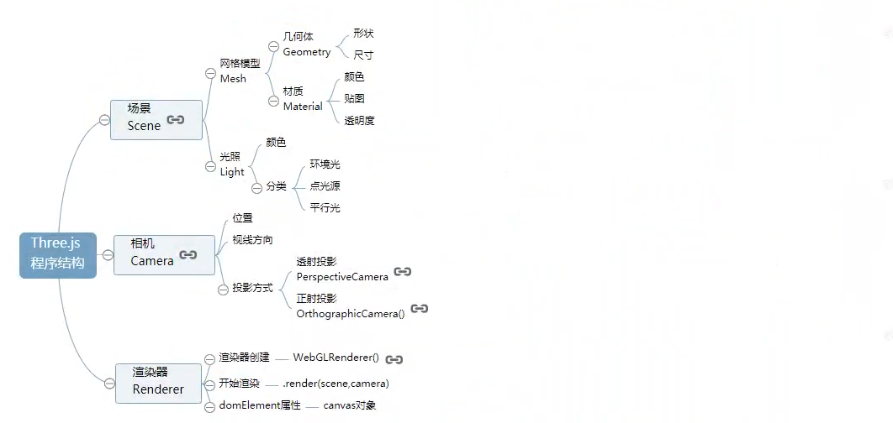
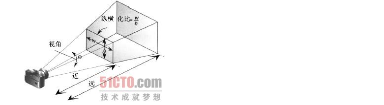
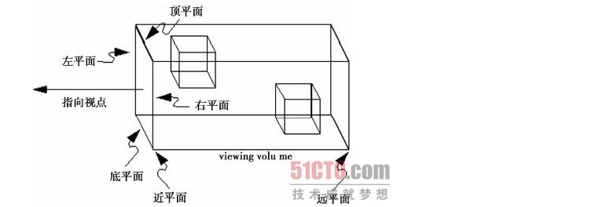
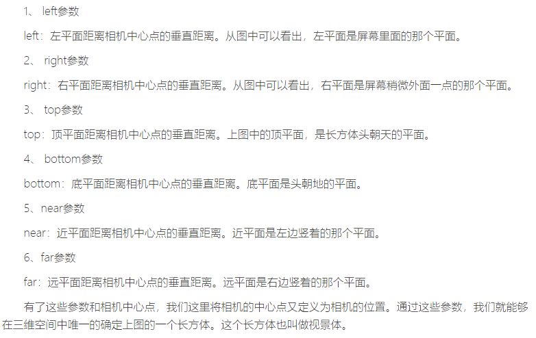
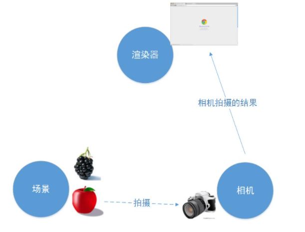
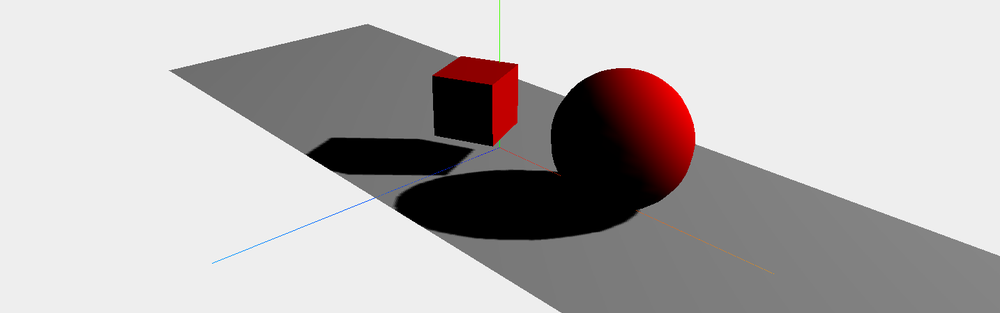

### 什么是WebGL

WebGL是一项可以在浏览器中流畅展示3D模型和场景的一种技术。它使用JavaScript作为编程语言，调用浏览器支持的3D绘制函数，来实现3D模型和场景的展现。

### 浏览器为什么能绘制3D世界

因为浏览器实现了 `opengl es` 的规范，这套规范可以 `直接使用指令操作显卡，使显卡渲染的3D世界`，直接反应到浏览器中。

### WebGL之three.js

`Three.js是一个封装好的webgl库`，它使WebGL的学习更加简单。

## threejs

`THREE.REVISION='133dev'` 目前练习使用的threejs的版本



### 三大组建

> 在Three.js中，要渲染物体到网页中，我们需要3个组建：场景（scene）、相机（camera）和渲染器（renderer）。有了这三样东西，才能将物体渲染到网页中去。

* 场景：场景是所有物体的容器，如果要显示一个苹果，就需要将苹果对象加入场景中。

```js
var scene = new THREE.Scene();  // 构建一个场景，场景是一个容器
```

* 相机：相机决定了场景中哪个角度的景色会显示出来。相机就像人的眼睛一样，人站在不同位置，抬头或者低头都能够看到不同的景色。
  * 透视相机：透视投影符合人们的心理习惯，即离视点近的物体大，离视点远的物体小，远到极点即为消失，成为灭点
  * 正投影相机：就是远处的和近处的是一样大

```js
//透视相机
THREE.PerspectiveCamera(fov,aspect,near,far)
var camera = new THREE.PerspectiveCamera(75,
window.innerWidth/window.innerHeight, 0.1, 1000);
```



`视角fov`：这个最难理解,我的理解是,**眼睛睁开的角度**,即,视角的大小,如果设置为0,相当你闭上眼睛了,所以什么也看不到,如果为180,那么可以认为你的视界很广阔,但是在180度的时候，往往物体很小，因为他在你的整个可视区域中的比例变小了。

`近平面near`：表示你近处的裁面的距离。补充一下，也可以认为是眼睛距离近处的距离，假设为10米远，请不要设置为负值，Three.js就傻了,不知道怎么算了,（0.1）

`远平面far`：表示你远处的裁面（一般2000即可）,

`纵横比aspect`：实际窗口（摄像机窗口）的横纵比，即**宽度除以高度**。这个值越大，说明你宽度越大，那么你可能看的是宽银幕电影了

```js
//正投影相机
THREE.OrthographicCamera( left, right, top, bottom, near, far )
var camera = new THREE.OrthographicCamera( width / - 2, width / 2, height / 2, height / - 2, 1, 1000 );

scene.add( camera );
```





* 渲染器：渲染器决定了渲染的结果应该画在页面的什么元素上面，并且以怎样的方式来绘制

```js
THREE.WebGLRenderer()

var renderer = new THREE.WebGLRenderer();   // 渲染器
renderer.setSize(window.innerWidth, window.innerHeight);    // 设置渲染器的大小为窗口的内宽度，也就是内容区的宽度
document.body.appendChild(renderer.domElement);
```

三者之间的关系：



### 练习

* 创建场景
* 渲染场景(“**渲染循环**”（render loop）或者“**动画循环**”（animate loop）)

使用setInterval就可以实现刷新的功能,但是**requestAnimationFrame**有很多的优点。最重要的一点或许就是当用户切换到其它的标签页时，它会暂停，因此不会浪费用户宝贵的处理器资源，也不会损耗电池的使用寿命。

```html
    <script src="./build/three.js"></script>
    <script>
        // 场景
        var scene = new THREE.Scene();
        //相机
        var camera = new THREE.PerspectiveCamera(75, window.innerWidth / window.innerHeight, 0.1, 1000);
        //渲染器
        var renderer = new THREE.WebGLRenderer();
        // renderer.setClearColor('#FFF')//设置场景的底色(背景色)
        renderer.setSize(window.innerWidth, window.innerHeight);
        document.body.appendChild(renderer.domElement);


        var geometry = new THREE.BoxGeometry(); //创建立方体所需要的立方体对象
        var material = new THREE.MeshBasicMaterial({
            color: '#ccc'
        });
        var cube = new THREE.Mesh(geometry, material);
        scene.add(cube);

        //调整相机远近
        camera.position.z = 5;

        //渲染循环    实时渲染：就是需要不停的对画面进行渲染，即使画面中什么也没有改变，也需要重新渲染.
        function render() {
            cube.rotation.x += 0.01;
            cube.rotation.y += 0.01;
            renderer.render(scene, camera);
            requestAnimationFrame(render); //这个函数就是让浏览器去执行一次参数中的函数，这样通过上面render中调用requestAnimationFrame()函数
        }
        render();
    </script>
```

### 综合练习


