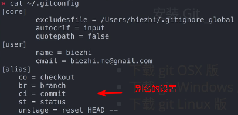
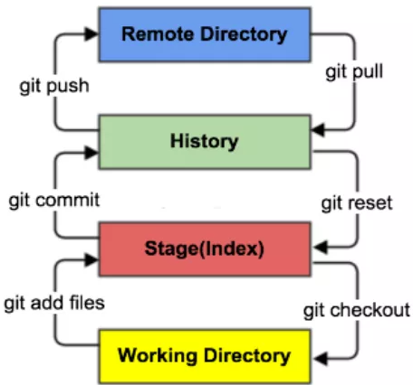
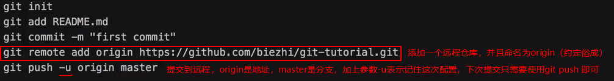
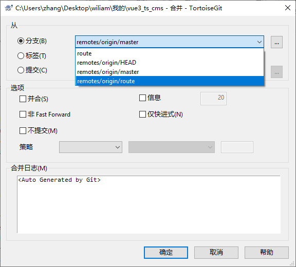
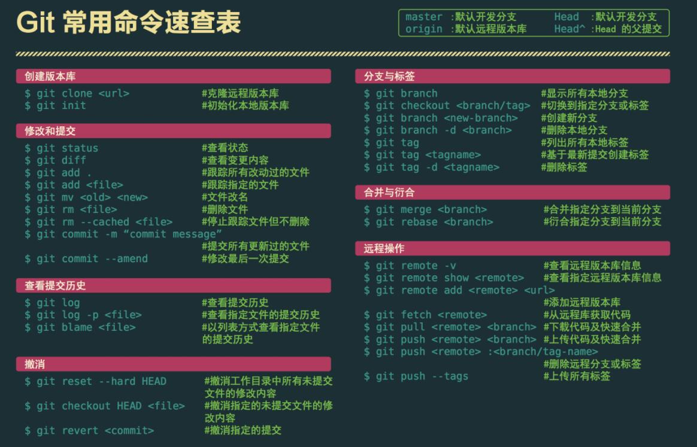
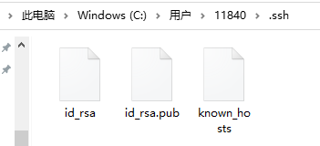
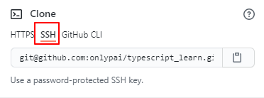
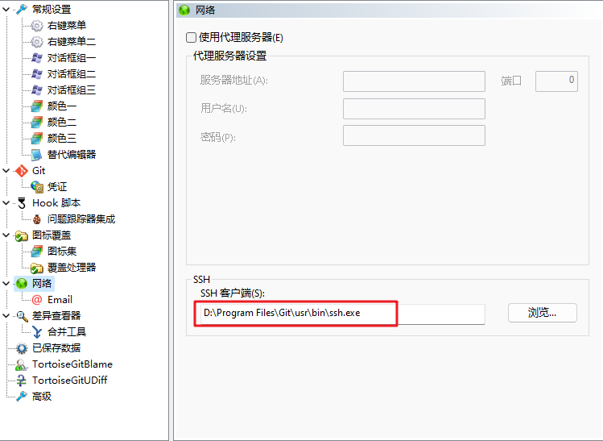

### Git与SVN的主要区别

SVN是`集中式版本控制系统`，`版本库是集中放在中央服务器的`，而工作的时候，用的都是自己的电脑，所以`首先要从中央服务器得到最新的版本`，然后工作，完成工作后，需要把自己做完的活推送到中央服务器。集中式版本控制系统是`必须联网才能工作`，对网络带宽要求较高。

Git是`分布式版本控制系统`，`没有中央服务器`，`每个人的电脑就是一个完整的版本库`，工作的时候不需要联网，因为版本都在自己电脑上。协同的方法是这样的：比如说自己在电脑上改了文件A，其他人也在电脑上改了文件A，这时，你们两之间只需把各自的修改推送给对方，就可以互相看到对方的修改了。Git可以直接看到更新了哪些代码和文件！

**Git是目前世界上最先进的分布式版本控制系统。**

### windows中git下载安装

官网下载慢，使用镜像下载

http://npm.taobao.org/mirrors/git-for-windows/

环境变量：环境变量只是为了在全局使用git，你在文件夹内使用gitbash其实不需要配置环境变量

查看是否安装完成：

```shell
git --version
```

### mac中git下载及安装

git国内镜像安装地址

https://www.newbe.pro/Mirrors/Mirrors-Git-For-MacOS/     输入网址就会下载（慎点）

某人的gitee： https://gitee.com/jyotish/HomebrewCN


安装之后配置用户名和邮箱，生成密钥之后，可以使用如下命令查看 `.ssh`文件夹

```shell
open ~/.ssh
```


### mac中homebrew安装

[homebrew国内安装脚本](https://gitee.com/cunkai/HomebrewCN)

```shell
/bin/zsh -c "$(curl -fsSL https://gitee.com/cunkai/HomebrewCN/raw/master/Homebrew.sh)"
```

### 常用linux命令

1）cd    改变目录。

2）cd . .   回退到上一个目录，直接cd进入默认目录

3）pwd    显示当前所在的目录路径。

4）ls(ll)   都是列出当前目录中的所有文件，只不过ll(两个ll)列出的内容更为详细。

5）touch    新建一个文件 如 touch index.js 就会在当前目录下新建一个index.js文件。

6）rm    删除一个文件, rm index.js 就会把index.js文件删除。

7）mkdir    新建一个目录,就是新建一个文件夹。

8）rm -r     删除一个文件夹, rm -r /src/dist 删除/src/dist目录      `-r:递归进行操作；-f:强制force`

```
rm -rf / 切勿在Linux中尝试！删除电脑中全部文件！
```

9）mv   移动文件, mv index.html src index.html 是我们要移动的文件, src 是目标文件夹,当然, 这样写,必须保证文件和目标文件夹在同一目录下。

​	 cp -rf ./dist/* /root/mall_cms/   `cp`拷贝文件，将dist文件夹下所有内容拷贝到/root/mall_cms/当中

10）reset   重新初始化终端/清屏。

11）clear   清屏。   `git bash 中使用clear，cmd中使用cls`

12）history   查看命令历史。

13）help   帮助。

14）exit   退出。

15）#   表示注释

### git 配置

#### 查看

```shell
#所有配置
git config -l

#查看系统config
git config --system --list
　　
#查看当前用户（global）配置
git config --global  --list
```

**Git相关的配置文件：**

1）、Git\etc\gitconfig  ：Git 安装目录下的 gitconfig   --system 系统级

2）、C:\Users\Administrator\ .gitconfig （或者C:\Users\ .gitconfig）只适用于当前登录用户的配置  --global 全局

#### 设置用户名与邮箱（用户标识，必要）

当你安装Git后首先要做的事情是设置你的用户名称和e-mail地址。这是非常重要的，因为每次Git提交都会使用该信息。它被永远的嵌入到了你的提交中：

```shell
git config --global user.name "onlypai"  #名称
git config --global user.email 2443@qq.com   #邮箱

cat ~/.gitconfig  #使用命令查看用户配置
```

 

### git基本理论

Git本地有三个工作区域：`工作目录（Working Directory）、暂存区(Stage/Index)、本地git仓库(Repository或Git Directory)`。如果在加上`远程的git仓库(Remote Directory)`就可以分为四个工作区域。

 

### git项目搭建及使用基本命令

#### 基本命令

```shell
#初始化本地仓库
git init
#克隆远程到本地
git clone 远程地址 [目录名]  #如果该仓库名有重复，可以在后面加上想要的目录名
# 克隆指定分支的代码
git clone -b branchName 远程地址


# 查看文件状态
git status [filename]
git status

#添加到暂存区
git add [filename]
git add .
git add -A

#从暂存区移除
git rm --cached [filename]

#提交到本地仓库 
git commit -m '日志'

#提交到远程仓库
git push

#更新远端仓库到本地（电脑A提交了，电脑B还没有同步，需要更新）
git pull [origin] [master]
```

1、使用命令`git init`创建本地仓库，但是提交的时候加上远程仓库的链接，步骤如下

 

2、创建好远程仓库，比如github的一个仓库，然后克隆远程仓库到本地，之后可以直接提交

```shell
git push
```

#### 分支

```shell
#创建分支
git branch 分支名
#预览所有分支（本地）
git branch  #前面有*号的就是当前所在分支，键入q退出预览
#预览所有分支（远端）
git branch -r
#切换到指定分支
git checkout 指定分支名

#创建并直接切换到新的分支
git checkout -b 分支名

#删除分支
git branch -d 分支名
#你在一个分支里面改动内容，必须先提交，才能操作该分支（切换分支、删除分支），否则执行不成功
#强制删除分支
git branch -D 分支名 #谨慎使用

#合并分支
#将A分支合并到main分支，需要先切换到main分支，在执行如下命令，没有冲突就会直接合并，合并之后就可以推送到远端
git merge A


#远端分支
#刚才创建的分支都是本地创建的，远端并没有分支

#创建本地分支AAA后添加内容，（新建并）提交到远端分支AAA
git push origin AAA  #此后远端仓库就多了一个分支
#删除远端分支
git push origin :AAA

#远端分支不想叫AAA
git push origin AAA:aaa  #本地叫AAA，远端叫aaa,一般不会闲的去改

#创建了分支之后，推送到远端需要在 git push 命令后加上分支名
git push origin 分支名

```

#### 合并

图形界面tortoiseGit

 

先切换到指定分支（例如main），点击合并选项，选择需要合并的分支（route），将route合并到main分支，最后`推送到远端`

```shell
git checkout main
git merge route
#或者使用
git merge --no-ff -m 'merge route into main' route
git push origin main
```


```shell
#查看日志
git log
git log --oneline #一行展示
git log --oneline -3 #最近三条日志
```


 

### ssh密钥的使用

使用密钥可以实现免密码提交

[Generating a new SSH key and adding it to the ssh-agent - GitHub Docs](https://docs.github.com/en/github/authenticating-to-github/connecting-to-github-with-ssh/generating-a-new-ssh-key-and-adding-it-to-the-ssh-agent)

密钥公钥生成：  -t 是加密   rsa是使用rsa加密的算法

```bash
ssh-keygen -t rsa
ssh-keygen -t rsa -C "你的名字/你的邮箱"
```

 公钥生成位置，之后把公钥配置到github中的ssh里面

 如果你想使用ssh密钥的的方式替代密码验证提交，在克隆仓库的时候就应该使用ssh的方式

### 错误

#### No supported authentication methods available (server sent: publickey)

tortoisegit中报错，但是在GitBash中没有错误，是TortoiseGit的配置问题，需要设置下TortoiseGit的SSH配置：ssh客户端改成git安装目录下的`ssh.exe`

 
