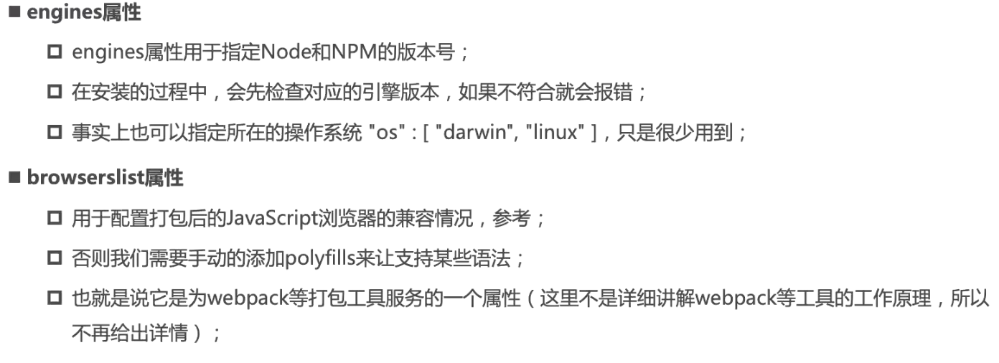

## 共享代码

* 上传到github，其他程序员下载代码手动使用
  * 缺点是大家必须知道你的github地址，并且从github中手动下载
  * 版本升级需要手动重复操作
* 使用专业的工具来管理我们的代码
  * 我们通过工具将代码发布到指定位置
  * 其他程序员直接通过工具安装、升级、删除我们的工具代码

## npm介绍

Node Package Manager

目前已经不仅仅是node包管理，在前端项目中我们也在使用他来管理依赖包

比如express、koa、react、axios、webpack....

[npm依赖包网站](npmjs.org)

npm管理的包存放在指定的`registry(一个仓库)`上面

当我们安装一个包时其实是从registry上面下载包

## 项目配置文件package.json

每个项目都会有一个对应的配置文件，无论是前端还是后端项目

这个配置文件会记录着你项目的名字、版本号、项目描述，以及你项目中`所依赖的其他库的信息和版本号`等

```shell
# 初始化package.json
npm init [-y] # 加上-y使用默认信息
```

package.json文件相关信息：

### name、version、private

 

### 配置脚本scripts

在script对象中配置相关脚本，之后使用`npm run 名字`来执行某个脚本

其中，`start、stop、test、restart`四个脚本是可以直接使用`npm start`形式来执行，不需要加`run`

```json
"scripts": {
    "dev": "vue-cli-service serve",
    "prettier": "prettier --write .",
    "build:prod": "vue-cli-service build",
    "build:stage": "vue-cli-service build --mode staging",
    "preview": "node build/index.js --preview",
},
```

### dependencies、devDependencies

 

> 开发服务器时，生产环境安装依赖时，不需要安装开发环境的包，就可以使用  --production

### engines、browserslist

 

## 版本管理问题

[semver版本规范](https://semver.org/lang/zh-CN/)，[npm semver](https://docs.npmjs.com/cli/v6/using-npm/semver/)

 

## npm install命令

`npm install yarn -g`   `全局安装`一般都是安装工具yarn、webpack等等

`npm install axios --save`  `局部安装(或者是项目安装)`分为开发时依赖和生产时依赖  

### 全局安装(误解)

通常`全局安装`一般都是安装`工具`yarn、webpack等等，并不是类似于axios、express这种库，所以全局安装并不能让我们在所在项目中使用axios等

全局安装之后，你无论在电脑里面的哪个终端里面，都可以使用，都会找到这个包对应配置环境变量

> 全局安装是安装一些工具

### 项目安装

```shell
# 开发环境依赖、生产环境依赖
npm install axios
npm i axios --save
# 开发环境依赖
npm i webpack --save-dev
# ⭐直接执行npm install:安装所有的package.json中的开发和生产环境的包，之后就会在项目文件夹下生产node_modules文件夹存放依赖包
```

### npm install原理

 

原理图解析

npm install执行之后, 首先会检查和获取 npm的配置,这里的优先级为:
`项目级的.npmrc文件 > 用户级的 .npmrc文件 > 全局级的 .npmrc > npm内置的 .npmrc 文件`
然后检查项目中是否有 package-lock.json文件

 

> 如果package-lock.json和package.json声明的版本不一致，不同的npm版本对应不同的方案
>
>  

### npm`缓存策略`机制

在实际的项目开发中，使用npm作为团队的最佳实践: `同一个项目团队,应该保持npm 版本的一致性`。
从上面的安装流程，在实际的项目开发中，如果每次都去安装对应依赖时，如果相关的依赖包体积过大或者是依赖于网络，无疑会增加安装的时间成本，那么，缓存在这里的就是一个解决问题的好办法。

```shell
# 查看本地缓存
npm config get cache

# 默认缓存位置
# mac系统一般是在   /Users/username/.npm
# windows系统一般是在  \Users\username\AppData\Local\npm-cache
```

`_cacache`的目录有三个文件:

content-v2
index-v5
tmp

其中,`content-v2`里面存放的是一些二进制的文件。为了使二进制的文件可读,把文件做压缩和解压缩处理。

 

 解压结果

`index-v5`文件夹中也是二进制描述文件，这些文件都是content-v2 文件的索引。

当 npm 执行的时候,通过 pacote 把相应的包解压到对应的 node_modules下面。npm下载依赖的时候, 先下载到缓存当中,再解压到我们的项目的 node_modules中。

紧接着呢, 我们在每次去安装资源的时候,会根据package-lock.json中的`integrity、verison、name` 相关信息会`生成一个唯一的key;这个key 就能够对应上 index-v5 目录下的缓存记录`; 如果发现有缓存资源,就会去找到 tar 包对应的hash值.
根据 hash再去找缓存中的tar包,然后再次通过 pacote将二进制文件解压缩进我们项目的 node_modules目录中，这样就省去了资源下载的网络开销。

 

这里需要注意的是, `这里的缓存策略是在 npm v5开始的`,那么在 v5之前, 每个缓存模块是在的 ~./npmrc 文件中以模块名的格式直接存储的
存储的格式:{cache}{name}{version}。

### package-lock.json

 

## yarn

 

```shell
# 删除node_modules再重新安装
yarn upgrade
# 初始化
yarn init -y
# 安装依赖包
yarn 或 yarn install
# 运行（yarn 运行脚本可以不加run）
yarn serve
# 安装某个包
yarn add axios [-D]
# 卸载某个包
yarn remove axios
# 强制重新安装所有包
yarn install --force    //npm rebuild
```

## cnpm

由于一些特殊原因，我们不能从`https://registry.npmjs.org`下载下来一些需要的包，这时可以将npm的镜像仓库改成淘宝的镜像仓库，但是，并`不建议直接将npm镜像给修改了`

 

```shell
# 查看npm镜像仓库
npm config get registry
# 设置npm镜像仓库
npm config set registry https://registry.npm.taobao.org # 不建议换
```

我们可以使用`cnpm`，并且将cnpm设置为淘宝的镜像仓库，你可以把cnpm看作是中国的npm

```shell
# 全局安装cnpm并且直接设置成淘宝的镜像仓库
npm install -g cnpm --registry=https://registry.npm.taobao.org
# 查看cnpm
cnpm config get registry
```

## npm开发脚手架

### 用到的库

#### [commander](https://github.com/tj/commander.js) 

完整的 node.js 命令行解决方案。

#### [download-git-repo](https://www.npmjs.com/package/download-git-repo)

#### [ejs](https://ejs.bootcss.com/)


### node知识补充

#### util模块

```js
const { promisify } = require('util')
const download = promisify(require('download-git-repo'))
//promisify()可以将原本为回调函数形式的转化成promise形式
```

process.**cwd**()    //当前进程的工作目录

#### npm.cmd、node中判断操作系统

> windows系统中，你在终端中执行`npm ...`，实际上执行的是对应目录里面的`npm.cmd ...`（yarn.cmd、webpack.cmd）,
>
> 终端会自动帮我们加上'.cmd',但是别的操作系统可以直接执行`npm ...`
>
>  

判断不同的操作系统执行不同的命令

`process.platform` 运行程序所在的平台系统 'darwin', 'freebsd', 'linux', 'sunos' or 'win32'

```js
const command = process.platform === 'win32' ? 'npm.cmd' : 'npm'
```

#### child_process 子进程

```js
const { exec, spawn } = require('child_process') //内置模块：子进程
const commandSpawn = (...args) => {
  return new Promise((resolve, reject) => {
    const childProgress = spawn(...args) //重新开启一个进程
    /**
     * 执行npm i的时候会有很多下载依赖信息log，我们把log信息显示在终端中
     * ⭐将子进程的 输出流 通过管道函数pipe()转移到进程中去
     */
    childProgress.stdout.pipe(process.stdout)
    childProgress.stderr.pipe(process.stderr) //错误信息
    childProgress.on('close', () => {
      //Promise用于告知用户：命令执行结束(进程关闭)
      console.log(
        `############################${args[0]} ${args[1].join(' ')}执行完毕!`
      )
      resolve()
    })
  })
}
```

### 脚手架发布

登录(进入项目文件夹)

```shell
C:\Users\zhang\Desktop\wiliam\我的\leopai_web_notes\nodejs\脚手架开发\wangy>npm login
npm notice Log in on https://registry.npmjs.org/
Username: username
Password:
Email: (this IS public) email@com
Enter one-time password from your authenticator app: 88888888
Logged in as leopai on https://registry.npmjs.org/.
```

修改package.json

```json
"keywords": ["vue","wangy","leopai","vue-cli"],
"author": "leopai",
"license": "MIT",
"homepage": "~",
"repository": {
  "type":"git",
  "url": "~"
},
```

执行发布

```shell
npm publish
```

再次执行发布，需要升级对应版本号

## npx

> npx的作用非常多，但是比较常用的是使用它来`调用项目中的某个模块的指令`

全局安装webpack@5.1.3，再局部安装webpack@3.6.0之后，

在项目文件夹下执行命令`webpack --version`得到的结果必然是**webpack 5.1.3**，

因为不知道要去项目中查找有没有webpack，如果你想使用项目下的webpack，需要执行`./node_modules/.bin/webpack --version`，才能得到**webpack 3.6.0**

但是这样来使用局部的包工具太麻烦了，用几种方式可以使用

* 可以在package.json中定义脚本，如：`"wwwwwww":"webpack --version"`，之后运行该指令，在这里直接写webpack的原因是`pakage.json中的命令会优先去node_modules去查找包`
* 使用npx：直接执行`npx webpack --version`，这时使用的就是局部的webpack（使用npx会优先去node_modules下的`.bin`文件夹去寻找）

## 常用命令


```shell
# 查看全局包
npm list -g --depth 0 # --depth 0 仅查看一级目录
# 或者
npm ls -g
```

#### rimraf删除node_modules

```shell
npm i -g rimraf
## 项目文件夹
rimraf node_modules
```


## 命令缩写

` install`：缩写为`i`，表示安装。

`--global`：缩写为`-g`，表示：全局标识，可以在任意目录中使用该工具。全局安装。

`--save`：缩写为`-S`，表示安装的包将写入package.json里面的dependencies。

`--save-dev`：缩写为`-D`，表示将安装的包将写入package.json里面的devDependencies。

`--save-optional`：缩写为`-O`，表示将安装的包将写入package.json里面的optionalDependencies。

`--save-exact`：缩写为`-E`，表示安装的包的版本是精确指定的。

`--save-bundle`：缩写为`-B`，表示将安装的包将写入package.json里面的bundleDependencies。

## npm安装依赖出错

使用npm安装包时，卡在sill idealTree buildDeps之后没有反应的问题

* 将npm镜像仓库换成淘宝的镜像仓库（不建议）

```shell
# 使用如下命令设置为淘宝镜像源
npm config set registry https://registry.npm.taobao.org # 不建议换
# 检验是否安装成功 
npm config get registry
# 再次执行需要安装的命令
```

* 安装cnpm，使用cnpm安装
* 使用yarn
