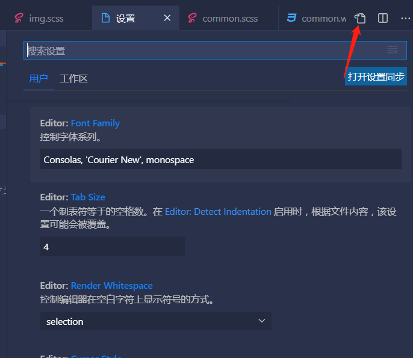
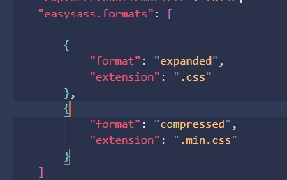
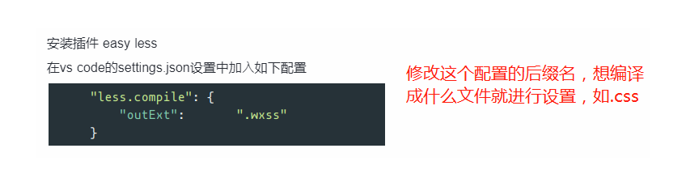
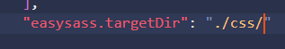
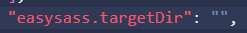

### CSS预处理器出现的原因

1. 无法嵌套书写导致代码繁重、冗杂、逻辑混乱。
2. 没有变量和样式复用机制，属性值只能以字面量的形式重复输出。

~~~shell
# 总结：代码复用性低；不易于维护
# 注：现在，现在的CSS是可以定义变量的！！！
~~~

~~~css
:root{
    --red: #f3e1e1;
}
~~~

### 出名的CSS预处理器介绍

#### 1. SCSS/SASS

SASS (.scss)。于2007年诞生，最早也是最成熟的CSS预处理器，拥有ruby社区的支持和compass这一最强大的css框架，目前受LESS影响，已经进化到了全面兼容CSS的SCSS。

#### 2. LESS

LESS (.less)。于2009年诞生，借鉴了SASS的长处，并兼容了CSS语法，使得开发者使用起来更为方便顺手，但是相比于SASS，其编程功能不够丰富，反而促使SASS进化成为了SCSS。

#### 3. Stylus

Stylus (.styl)。于2010年诞生，出自Node.js社区，主要用来给Node项目进行CSS预处理支持，人气较前两者偏低。

### sass和scss之间的关系

简而言之：

~~~
Sass有两套语法：

1.第一种或更新的语法被称为SCSS。它是CSS语法的扩展。这意味着每个有效的CSS样式表都是具有相同含义的有效SCSS文件。下文描述的Sass功能增强了此语法。使用此语法的文件扩展名为.scss。

2.第二种或更旧的语法被称为SASS。提供了一种更为简洁的CSS编写方式。它使用缩进而不是方括号来表示选择器的嵌套，并使用换行符而不是分号来分隔属性。使用此语法的文件扩展名为.sass。

任何一种格式可以直接 导入 (@import) 到另一种格式中使用，或者通过 sass-convert 命令行工具转换成另一种格式
~~~

### 使用CSS预处理器的优劣

#### 1.优点

~~~
CSS预处理器为CSS增加一些编程的特性，无需考虑浏览器的兼容性问题。支持嵌套、变量和逻辑等。可以让CSS更加简洁、提高代码复用性、逻辑分明等等
~~~

#### 2.缺点

~~~
css的文件体积和复杂度不可控；增加了调试难度和成本等。
~~~

### 选择SCSS的原因

1. 官方介绍

   ~~~
   Sass 是一款强化 CSS 的辅助工具，它在 CSS 语法的基础上增加了变量 (variables)、嵌套 (nested rules)、混合 (mixins)、导入 (inline imports) 等高级功能，这些拓展令 CSS 更加强大与优雅。使用 Sass 以及 Sass 的样式库（如 Compass）有助于更好地组织管理样式文件，以及更高效地开发项目。
   ~~~

2. 特色功能

   - 完全兼容 CSS3
   - 在 CSS 基础上增加变量、嵌套 (nesting)、混合 (mixins) 等功能
   - 通过函数进行颜色值与属性值的运算
   - 提供控制指令 (control directives)等高级功能
   - 自定义输出格式

### 环境配置

less、scss(sass)和stylus代码并不能被浏览器直接解析，所以必须先将它们编译成css代码
`现有框架已经提供了css预处理器选项，编译相关配置会自动帮我们生成！`所以只有在"练习"情况下才有必要安装该环境

### 安装

#### 1.不依赖编辑器

~~~shell
# 全局安装scss预处理器，使用终端命令实现编译

a. Node环境下的node-sass模块
b. Node环境下的dart-sass模块
c. Ruby环境下的sass模块
d. Dart环境下的sass模块
~~~

> 注：这里的推荐顺序针对的是"练习"场景，而`开发环境下推荐使用的是dart-sass`
>
> 本质：某个语言的第三方库或者命令行工具

#### 2.依赖编辑器

~~~
vscode   安装Easy Sass（编译）和Sass（代码提示）两个插件
~~~

### 安装步骤

#### 1.不依赖编辑器（只介绍Node环境）

##### node-sass

安装

~~~shell
1. 安装node 
2. 安装cnpm
npm i -g cnpm --registry=https://registry.npm.taobao.org

3. 安装node-sass 
npm i -g node-sass
4. 检查是否安装成功
node-sass -v
~~~

使用

1. 单文件编译

   ~~~shell
   node-sass  原有的scss文件 生成的css文件
   node-sass  原有的scss文件 -o 生成目录
   
   # example:
   node-sass a.scss b.css
   node-sass a.scss css_files
   ~~~

2. 多文件编译

   ~~~shell
   node-sass 原有的scss文件目录 -o 生成的css文件目录
   
   # example:
   node-sass c -o d
   ~~~

3. 文件监听模式

   ~~~shell
   # 在"1"和"2"的基础上填加"-w"命令行参数即可
   node-sass -w 原有的scss文件 -o 生成目录
   node-sass -w 原有的scss文件目录 -o 生成的css文件目录
   
   # example:
   node-sass -w scss -o css
   
   # 效果：编译进程不结束，监听文件内容
   ~~~

##### dart-sass

安装

~~~shell
1. 安装node  https://nodejs.org(官网) 或 https://npm.taobao.org/mirrors/node(镜像)
2. *安装cnpm(不推荐直接将源换为淘宝镜像!!) $npm i -g cnpm --registry=https://registry.npm.taobao.org
3. 安装dart-sass $npm i -g sass  或  $cnpm i -g sass

# 注：该模块为第三方库，所以可以考虑使用cnpm i sass -D(-D == --save-dev)仅对某个小项目当做开发时依赖进行使用
~~~

使用

~~~js
/* 该模块的官方文档：https://sass-lang.com/documentation/js-api */

const sass = require('sass');

sass.render({file: scss_filename}, function(err, result) { /* ... */ });
// OR
const result = sass.renderSync({file: scss_filename});

// 注：默认情况下renderSync()的速度是render()的两倍以上，这是由于异步回调所带来的开销而导致的
~~~

#### 2.依赖编辑器

##### 😀 WebStrom

- 安装上述命令行工具之一（以node-sass为例演示）
- 依次打开并点击：webstrom -> Settings -> Tools -> Files Watchers -> + -> 选择SCSS文件标识
- Name随意写，供自己看而已
- File Type选择SCSS Style Sheet 
- Scope选择All Places
- Program选择可执行文件的路径（这里以node-sass为例）
- Arguments按需选择（这里以*$FileName$:$FileNameWithoutExtension$.css*为例）
- Output paths to refresh按需选择（这里以*$FileNameWithoutExtension$.css*为例）
- 点击OK，配置完成

##### 😀 VSCode

- 安装Easy Sass（编译）和Sass（代码提示）两个插件（注意大小写，否则找不到）

- "在settings.json中编辑"，开始设置关于Easy Sass的配置

   点击vscode中的设置，再点击这个就可以转到settings.json

 **这是配置 .scss文件编译成 .css文件和 .min.css文件，如果想编译成.wxss文件就把这个改了即可**

> 

- 添加`"easysass.targetDir": $path`，可将编译后的css文件放入`$path`路径下(默认为当前路径)。例如生成到css文件下内

不设置就显示会在.scss文件旁边

`easy sass无法识别相对路径，所以使用@import引入是会报错`