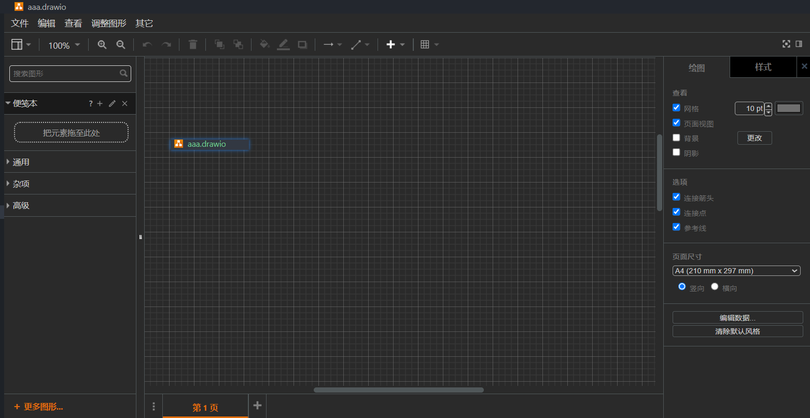
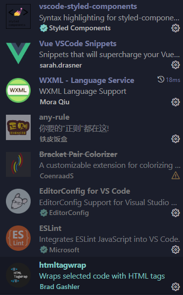
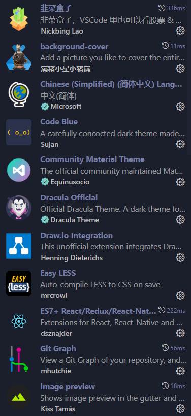
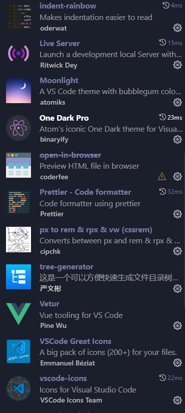
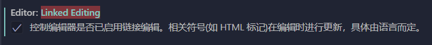

### 主题

Code Blue 蓝色主题

Easy Sass  编译.scss文件

Sass  .scss文件代码提示

Material Icon Theme 文件图标主题

Bracket Pair Colorizer 2 括号颜色对齐高亮 （现内置于vscode）

background-cover 背景图片

EditorConfig for VS Code  集成editorconfig配置，读取.editorconfig 文件

Prettier-Code formatter  代码格式化插件

ESLint  代码检测

WXML - Language Service  微信小程序.wxml文件代码高亮，标签、属性的智能补全（同时支持原生小程序、mpvue 和 wepy 框架，并提供code snippets）

Vetur  vue代码提示

px to rem & rpx & vw (cssrem)  

Live Server  本地服务

Draw.io Integration 画图 

文件名以`.drawio`结尾

 

   

### 设置

#### Linked Editing

 

开启后，可同步修改首尾标签
