### office安装并激活

下载`Office Tool Plus`软件，下载（office专业增强版2019，下面附激活命令）

安装后选择激活，安装许可证，上方终端输入激活命令`/osppilbyid ProPlus2019Volume /osppsethst:kms.loli.beer /osppsetprt: 1688 /osppact`

 ### win11右键菜单恢复win10

打开终端

恢复win10右键：

```csharp
reg.exe add "HKCU\Software\Classes\CLSID\{86ca1aa0-34aa-4e8b-a509-50c905bae2a2}\InprocServer32" /f /ve 
```

恢复win11右键：

```cpp
reg.exe delete "HKCU\Software\Classes\CLSID\{86ca1aa0-34aa-4e8b-a509-50c905bae2a2}\InprocServer32" /va /f 
```

### alibaba矢量图标使用

1、找到自己想要的图标添加到`项目`

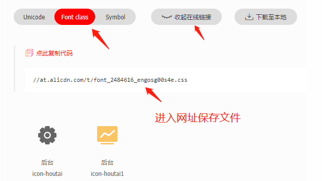 

3、引入保存的css文件（使用什么预处理器就改成对应的后缀）

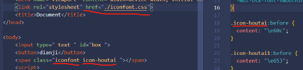 

使用的时候指定类名为**iconfont  图标类名**即可

### github加速

gitee   [dev-sidecar](https://gitee.com/docmirror/dev-sidecar?_from=gitee_search)

克隆出错需关闭该应用

### navicat

迅雷链接：https://pan.xunlei.com/s/VN-kFQc-tpco9-FLOuLc0Rx1A1
提取码：3t5s

* 安装之后，断网！
* 管理员身份打开Nacicat_key，点击右上角patch 

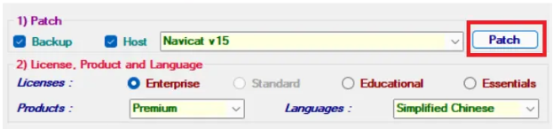 

选择安装文件夹的navicat.exe

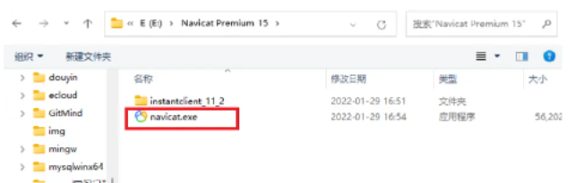 

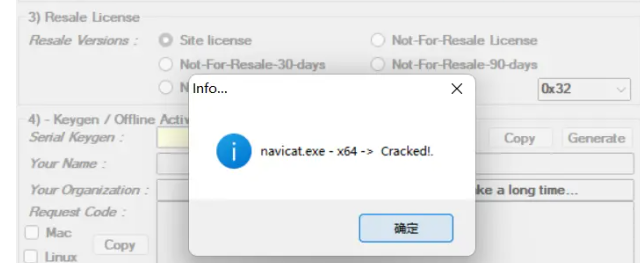 

> 提示`No All Pattern Found File Already Patched?`
>
> 因为之前软件数据有残留导致的，这种情况有两种方法可以解决：一种是可以用安装包直接在现在的安装路径下重新安装一遍，不需要卸载，就可以了。另一种是可以将原有的残留[注册表](https://so.csdn.net/so/search?q=注册表&spm=1001.2101.3001.7020)数据删除即可。
>
> 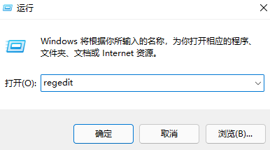 
>
> 打开注册表，找到 注册表项**计算机\HKEY_CURRENT_USER\Software\PremiumSoft**
>
> 将 **PremiumSoft**文件夹删除

* 点击确定后，点击Generate，左边自动生成一串连续码

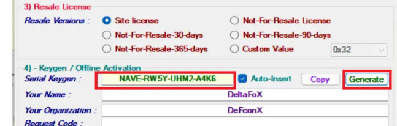 

* 打开Navicat15，点击注册，输入连续码
  点击手动激活，把请求码全部复制
  打开Navicat_key，把请求码放进下方输入框，点击旁边的Generate

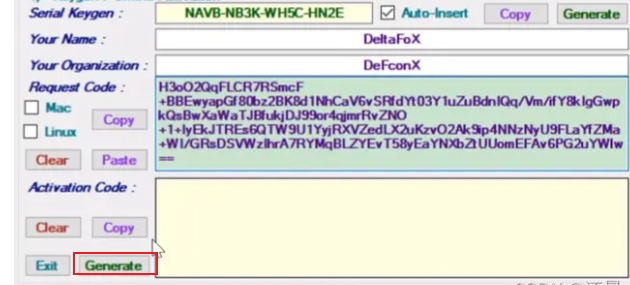 

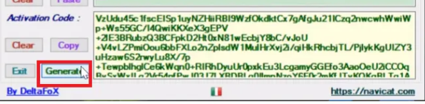 

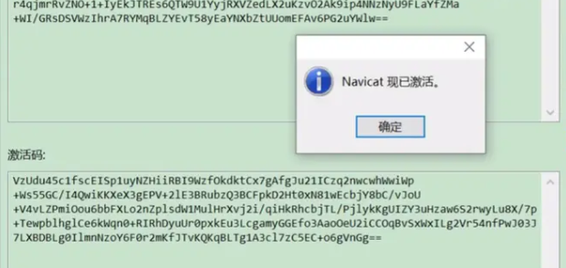 

### postman执行脚本

案例：token设置成变量使用

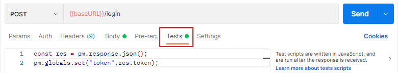 

点击登录执行登录业务的时候，在`Tests`里面执行脚本，将结果中的token设置成变量`token`，之后在别的地方直接使用`{{token}}`即可

```js
const res = pm.response.json();
pm.globals.set("token",res.token);
```

### vscode添加代码片段

文件>首选项>用户片段>以`html`为例，找到`html.json`

[使用代码片段生成器](https://snippet-generator.app/)

```json
{
	// Place your snippets for html here. Each snippet is defined under a snippet name and has a prefix, body and 
	// description. The prefix is what is used to trigger the snippet and the body will be expanded and inserted. Possible variables are:
	// $1, $2 for tab stops, $0 for the final cursor position, and ${1:label}, ${2:another} for placeholders. Placeholders with the 
	// same ids are connected.
	// Example:
	"create react snippet": {
		"prefix": "reactapp",//命令
		"body": [
			"<!DOCTYPE html>",
			"<html lang=\"en\">",
			"  <head>",
			"    <meta charset=\"UTF-8\" />",
			"    <meta http-equiv=\"X-UA-Compatible\" content=\"IE=edge\" />",
			"    <meta name=\"viewport\" content=\"width=device-width, initial-scale=1.0\" />",
			"    <title>Document</title>",
			"  </head>",
			"  <body>",
			"    <div id=\"app\"></div>",
			"    <script",
			"      src=\"https://unpkg.com/react@16/umd/react.development.js\"",
			"      crossorigin",
			"    ></script>",
			"    <script",
			"      src=\"https://unpkg.com/react-dom@16/umd/react-dom.development.js\"",
			"      crossorigin",
			"    ></script>",
			"    <script src=\"https://unpkg.com/babel-standalone@6/babel.min.js\"></script>",
			"    <script type=\"text/babel\">",
			"      class App extends React.Component {",
			"        constructor() {",
			"          super()",
			"          this.state = {",
			"            ",
			"          }",
			"        }",
			"        render() {",
			"          return (",
			"            <div>",
			"            </div>",
			"          )",
			"        }",
			"      }",
			"      ReactDOM.render(<App />, document.getElementById('app'))",
			"    </script>",
			"  </body>",
			"</html>"
		],
		"description": "snippet of react"
	}
}
```


