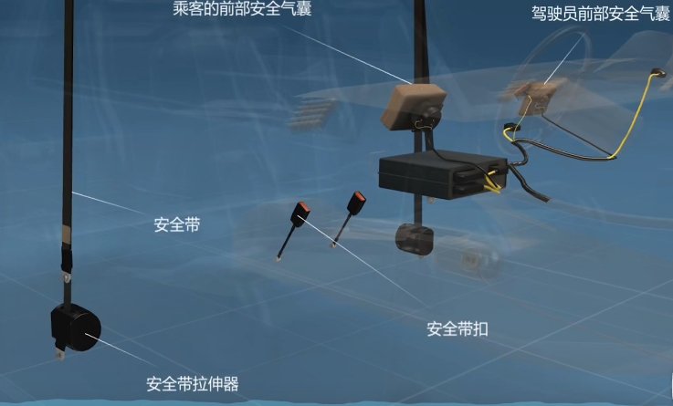

## 汽车架构

### 冷却系统

 

这几个部件的构成使发动机在所有工况下都能保持在适当的温度范围内

冷却系统既要防止发动机过热，也要防止冬季发动机过冷

### 燃油系统

 

像发动机供应具有一定压力的燃油，也有过滤燃油中的杂质和灰尘的功能，并调节燃油供给量

### 转向系统

 

改变或维持汽车驾驶或倒退方向

遵循行驶员的意愿调节汽车的驾驶方向

### 悬挂系统

 

* 独立悬挂

独立悬挂的车轴分成两段，每只车轮由螺旋弹簧独立安装在车架下面，当一边车轮发生跳动时，另一边车轮也不会受影响，两边的车轮可以独立运动，提高了汽车的平稳性和舒适性

* 非独立悬挂

非独立悬挂的车轮装在一根整体车轴的两端，当一边车轮跳动时，另一侧车轮也相应跳动，是整个汽车震动或倾斜

### 电气系统

 

电气系统部件多，除了车载电脑在驾驶室内，发动机舱集合了电池、保险丝座、大灯连接器以及束线等，电气系统是汽车的重要组成部分之一，其性能好坏直接影响汽车的动力性、经济性、可靠性、安全性、舒适性以及排放等性能

### 传动系统

 

汽车传动系统是汽车发动机与驱动轮之间的所有动力传递装置的总称，最基本的作用就是进行动力之间的传送，也就是说，汽车发动机在发动的时候产生的动力，需要经过传动系统来转化成驱动车轮运动的动力，从而可以使汽车获得运动的速度

### 排气系统

 

排气系统顾名思义是把发动机经过燃烧的废气排出，同时对废气进行过滤与降噪

### 引擎

 

 为汽车提供动力，能量转换装置，其作用是将汽油或者柴油的热能通过在密封的气缸内燃烧后膨胀气体，然后推动活塞做功，转变为机械能而产生动力

### 刹车系统

 

刹车盘和制动钳是汽车行驶中最容易耗损的两个部分，任何一个部分瘫痪，都有可能危机驾驶员的安全

### 安全系统

 

## 汽车选购

倒车雷达、并线辅助、防眩目后视镜、车身稳定系统ESP、上坡辅助

1：倒车雷达
①）：如果同时还有影像，甚至是360°全景，是更好，通过超声波反射，雷达可以准确地探测车尾的盲区，来帮助新手朋友们控制住和后方障碍物的距离。
2：并线辅助
①）：并线辅助，就能通过雷达来帮我们实时监测左右两侧的斜后方向，相邻车道上容易忽略的盲区。如果有车的时候，就会通过A柱或者后视镜等部位的警示灯
②）：奔驰公司曾经做过一个统计研究：如果驾驶员能够及时地感知危险，并且提前0.5s采取处理措施，可以避免50%的左右路面状况相关的事故。
3 自动防眩目后视镜
①）：炫光的影响会使驾驶员的反应时间增加1.4s。如果是120km/h开高速，1.4s，4、50m开出去了，一台车子差不多就4、5m，10台车子的距离。
4：车身稳定系统
①）：就好像：车子上面配了一个24小时全天候工作的安全教练，一旦我们操作失误，或者遇到突发情况，就会马上发现，自动进行修正。
5：上坡辅助
①）：有了上坡辅助，就可以在脚离开刹车踩下油门前，空着的部分，自动保持住刹车的油压，车子不会往后走，是非常实用的。
②）：上坡辅助的评估值，排在自动辅助类配置的第1名，可以算 是相当地推荐的一个配置了。
总结：这5样配置，提升了行车体验与安全